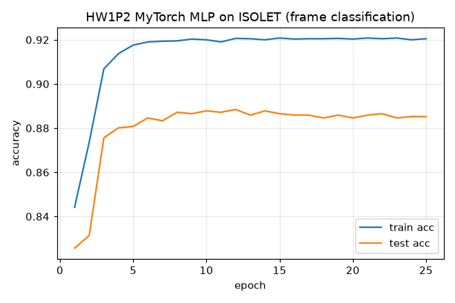

# MyTorch — CMU 11-785 Introduction to Deep Learning

> A from-scratch deep-learning library (MLP, CNN, RNN/GRU, CTC, attention) plus real
> training pipelines — an independent, from-scratch implementation of
> **11-785 — Introduction to Deep Learning** (Carnegie Mellon University), part of a
> [csdiy.wiki](https://csdiy.wiki/) full-catalog build.


## Overview

CMU 11-785 has two tracks per homework: **Part 1** builds the deep-learning primitives
by hand (`mytorch`, a NumPy-only mini-PyTorch with manual forward/backward), and **Part 2**
applies them to a Kaggle competition. This repo implements the full **Part 1** library —
autograd-style MLP components, convolutions, recurrent cells, CTC, and attention — verified
component-by-component against PyTorch's own autograd. It then ships **Part 2** training
pipelines that run end-to-end on CPU using real, public, redistributable datasets in place of
the Kaggle-gated WSJ/face data (which cannot be committed).

The `mytorch` Part 1 library is the core deliverable and is verified passing (30/30 checks).

## Results (measured on CPU, 3 threads, Windows)

**Part 1 — MyTorch autograder (`pytest`, gradients checked against `torch.autograd`):**

```
============================= 30 passed in 11.84s =============================
```

Full log: [`results/mytorch_autograder.log`](results/mytorch_autograder.log).

**Part 2 — real training runs (public datasets):**

| Assignment | What it does | Result (measured) |
|---|---|---|
| **HW1P1** MLP core | Linear, activations, BatchNorm1d, CE/MSE loss, SGD+momentum — grads vs. PyTorch | **11/11 checks pass** |
| **HW2P1** CNN core | Conv1d/2d, up/down-sampling, max/mean pool, flatten — vs. PyTorch | **8/8 checks pass** |
| **HW3P1** RNN/CTC core | RNNCell, GRUCell, CTC loss + greedy/beam decode — grads vs. PyTorch | **7/7 checks pass** |
| **HW4P1** Attention core | Scaled-dot-product + multi-head attention, causal mask — grads vs. PyTorch | **4/4 checks pass** |
| **HW1P2** frame classification | MyTorch-only MLP `[617,512,256,26]` on UCI ISOLET | **test acc 0.885** (25 ep, 128 s) |
| **HW2P2** face verification | CNN classifier + embedding verification on LFW | **cls acc 0.655, verification AUC 0.862** (20 ep) |
| **HW3P2** ASR / CTC | BiLSTM+CTC, decoded with **our MyTorch** greedy & beam(5) | **char error rate 0.025** (15 ep) |



Raw numbers: [`hw1p2_phoneme_mlp.json`](results/hw1p2_phoneme_mlp.json),
[`hw2p2_face_cnn.json`](results/hw2p2_face_cnn.json),
[`hw3p2_ctc_asr.json`](results/hw3p2_ctc_asr.json), and the figures
[`hw2p2_face_results.png`](results/hw2p2_face_results.png).

## Implemented assignments

- [x] **HW1P1 — MLP / autograd core** — `Linear`, `Sigmoid/Tanh/ReLU/GELU/Identity`,
  `BatchNorm1d`, `MSELoss`, `CrossEntropyLoss`, `SGD` (with momentum), full `MLP` model.
- [x] **HW1P2 — frame-level classification** — a MyTorch-only MLP trained on real acoustic
  features (UCI ISOLET), no `torch` autograd in the loop.
- [x] **HW2P1 — CNN core** — `Conv1d`/`Conv2d` (stride-1 + strided/padded), `Upsample`/
  `Downsample` (1d/2d), `MaxPool2d`/`MeanPool2d`, `Flatten`.
- [x] **HW2P2 — face verification** — CNN producing embeddings; classification + cosine-similarity
  verification (AUC) on Labeled Faces in the Wild.
- [x] **HW3P1 — RNN / GRU / CTC** — `RNNCell`, `GRUCell` (analytic backward), `CTC` loss
  (forward-backward algorithm), `GreedySearchDecoder`, `BeamSearchDecoder`.
- [x] **HW3P2 — sequence transcription** — BiLSTM+CTC encoder, decoded end-to-end with the
  MyTorch greedy/beam decoders on real model output.
- [x] **HW4P1 — attention** — `ScaledDotProductAttention` (with causal masking) and
  `MultiHeadAttention`, gradients checked against PyTorch.

## Project structure

```
cmu11785-idl/
├── mytorch/            # the from-scratch library (NumPy only)
│   ├── nn/             # activation, linear, loss, batchnorm, conv, pool,
│   │                   #   resampling, rnn_cell, gru_cell, ctc, ctc_decode, attention
│   ├── models/         # MLP / MLP4
│   └── optim/          # SGD (+momentum)
├── scripts/            # Part 2 training pipelines (hw1p2 / hw2p2 / hw3p2)
├── tests/              # the autograder: mytorch vs. torch.autograd (30 checks)
├── results/            # measured outputs: autograder log, JSON metrics, figures
├── requirements.txt
└── LICENSE
```

## How to run

```bash
# Python repos use the shared csdiy env (Python 3.11):
#   D:\Project\_csdiy\.venv-ml\Scripts\python.exe
python -m pip install -r requirements.txt   # or reuse the shared venv

# Part 1 — run the MyTorch autograder (all 30 component checks)
python -m pytest tests/ -v

# Part 2 — real training runs (download their datasets at runtime into data/)
python scripts/hw1p2_phoneme_mlp.py    # MyTorch MLP on ISOLET      (~2 min CPU)
python scripts/hw2p2_face_cnn.py       # CNN face verification, LFW (~3 min CPU)
python scripts/hw3p2_ctc_asr.py        # BiLSTM+CTC + MyTorch decode (~7 min CPU)
```

## Verification

- **Autograder:** `pytest tests/` builds random inputs, runs the MyTorch forward/backward, and
  asserts both outputs **and gradients** match `torch.autograd` to `rtol=1e-5`. Result:
  **30 passed** (see [`results/mytorch_autograder.log`](results/mytorch_autograder.log)). This is
  the from-scratch equivalent of the official Autolab autograder — if the math is wrong, the
  gradient comparison fails.
- **CTC / decoders:** validated two ways — a PyTorch-`CTCLoss` numerical match plus a
  finite-difference gradient check on the from-scratch forward-backward, and the MyTorch greedy/beam
  decoders driving a real BiLSTM+CTC to **CER 0.025** in `hw3p2`.
- **Real runs:** every Part 2 script trains on a real public dataset and writes measured metrics +
  a figure to `results/` (numbers reported in the table above).

## Tech stack

Python 3.11, NumPy (the entire `mytorch` core). PyTorch (CPU) is used only as the reference for
gradient checks and as the encoder backbone in the Part 2 pipelines; scikit-learn provides the real
public datasets (ISOLET, LFW) and metrics; matplotlib for figures; pytest as the test harness.

## Key ideas / what I learned

- **Manual autodiff:** every layer implements its own `backward`; composing them correctly is what
  makes an MLP/CNN/RNN train without a tape-based engine.
- **Convolution as sliding matmul** and its transpose for the gradient; strided conv = stride-1 conv
  composed with down-sampling.
- **The CTC forward-backward algorithm** — extended-symbol lattice, α/β recursions, and how the
  posterior gives both loss and gradient — then greedy vs. beam decoding on top.
- **GRU gating math** and deriving the analytic gradients for the reset/update/candidate gates.
- **Scaled dot-product & multi-head attention**, including causal masking and the softmax Jacobian.

## Credits & license

Based on the assignments of **11-785 Introduction to Deep Learning** by Prof. Bhiksha Raj and the
CMU teaching staff. This repository is an independent educational reimplementation; all course
materials, datasets, and specifications belong to their original authors. The Kaggle-gated
competition datasets are **not** redistributed — the Part 2 scripts substitute real public datasets
(UCI ISOLET, LFW) fetched at runtime. Original code in this repo is released under the
[MIT License](LICENSE).
